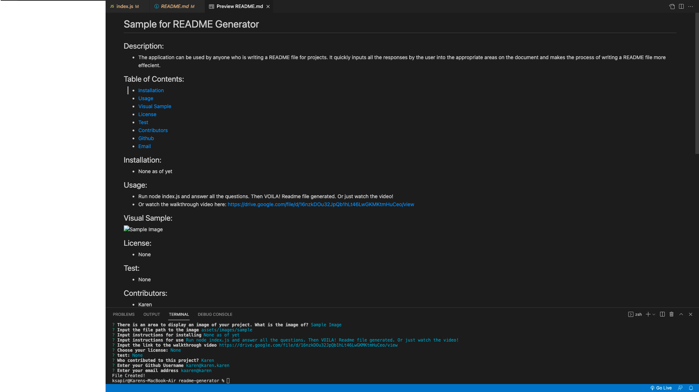

# README Generator

## Description:
- This application can be used by anyone who is writing a README file for their project. It quickly inputs all the responses by the user into the appropriate areas on the document to make the process of writing a README file more effecient. *This README file was generated by the README Generator!*

## Table of Contents:
- [Installation](#installation)
- [Usage](#usage)
- [Visual Sample](#visual)
- [License](#license)
- [Test](#test)
- [Contributors](#contributors)
- [Github](#github)
- [Email](#email)

## Installation:
- None yet.

## Usage:
- Run node index.js, answer the prompts, then VOILA! Readme generated. Or just watch the video walkthrough!
- Or watch the walkthrough video here:
https://drive.google.com/file/d/16nzkDOu32JpQb1hLt46LwGKMKtmHuCeo/view

## Visual Sample:

## License:
- None

## Test:
- None yet

## Contributors:
- Karen Pion

## Contact:
- Github: https://github.com/ksapir
- Email: karenlpion@gmail.com
